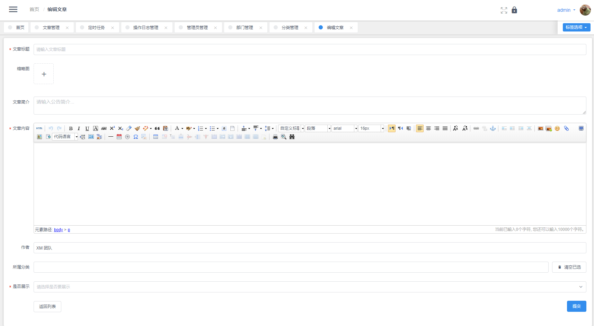

Xm Spring Boot
===================================
这是一个Spring Boot的基础项目

后台 http://127.0.0.1:20003 (账号：admin, 密码:123456) 前端 http://127.0.0.1:20001 (/api/user/login  /api/user/register /api/user/info)

如果你更需要Spring-cloud版本，请移步 [xm-skeleton](https://github.com/xiaomalover/xm-skeleton "XM Skeleton"). 

目录结构
--------

```
admin-server-template                   管理后台模板，用vue.js搭建
admin-server                            管理后台服务
api-server                              接口服务
common-lib                              公共资源
generator                               基于Mybatis-plus的生成工具
```

运行
--------
1, 先导入根目录下的数据库

2, 启动管理后台，API服务

3, 测试请用postman 导入要目录下的 xm_boot.postman_collection.json

功能
-------

1. 完整的后台管理系统，后端模板采用vue.js开发, 权限可以控制到按钮
2. 用户注册，登录，token存储redis
3. 代码自动生成，可自己指定生成模块，基于Mybatis-Plus实现
4. 文章管理，tinymce富文本编辑器，图片上传

    ...

开发注意
---------
开发后台模板，请先安装nodeJs到你的系统，然后进入admin-server-template目录中依次执行
```
$ npm install
$ npn run dev
```
如果开发完成了，请执行以下命令, 然后把dist目录里生成的资源文件拷贝到，admin-server的resources的static目录下。
```
$ npm run build
```

项目截屏
---------





联系作者
---------
如果有任何安装问题，请加我微信，如果你觉得对你有用，请帮忙star, 让更多人看到此项目，希望能帮到大家。


